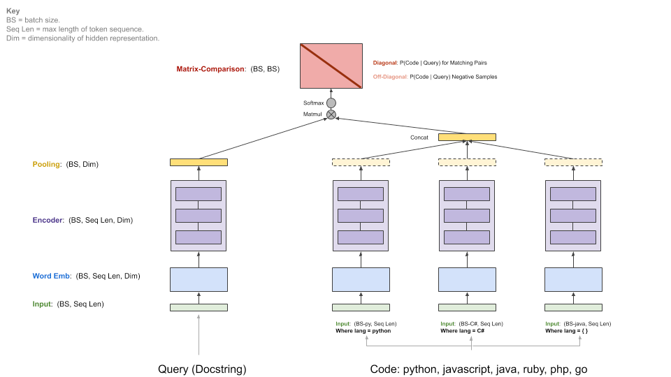

# Smart Code 

## CodeSearchNet

https://github.com/github/CodeSearchNet

>  Datasets, tools, and benchmarks for representation learning of code.

## Semantic Code Search

https://github.com/overwindows/SemanticCodeSearch

Semantic code search implementation using Tensorflow framework and the source code data from the CodeSearchNet project.
The model training pipeline was based on the implementation in CodeSearchNet repository. 
Python, Java, Go, Php, Javascript, and Ruby programming language are supported.

