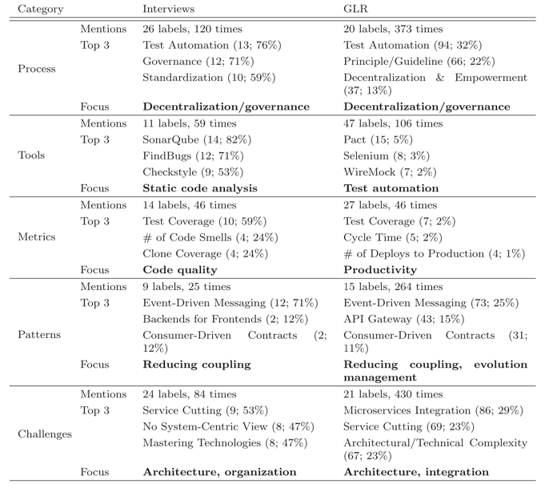

# Metrics

## A Tool-Based Perspective on Software Code Maintainability Metrics: A Systematic Literature Review

| Metric suite            | Metric                                                                           | Mentioned by                                                                                                                                                                                                                                                                                                                                                                                                                                                                                                                                                                                                                                                                                                                                                                                                                                                                                                                                                                                                                                                                  | TOT | Score |
|-------------------------|----------------------------------------------------------------------------------|-------------------------------------------------------------------------------------------------------------------------------------------------------------------------------------------------------------------------------------------------------------------------------------------------------------------------------------------------------------------------------------------------------------------------------------------------------------------------------------------------------------------------------------------------------------------------------------------------------------------------------------------------------------------------------------------------------------------------------------------------------------------------------------------------------------------------------------------------------------------------------------------------------------------------------------------------------------------------------------------------------------------------------------------------------------------------------|-----|-------|
| —                       | Avg CC, average cyclomatic complexity                                            | [[5](https://www.hindawi.com/journals/sp/2020/8840389/#B5), [54](https://www.hindawi.com/journals/sp/2020/8840389/#B54)]                                                                                                                                                                                                                                                                                                                                                                                                                                                                                                                                                                                                                                                                                                                                                                                                                                                                                                                                                      | 2   | 2     |
| —                       | CA, afferent coupling                                                            | [[5](https://www.hindawi.com/journals/sp/2020/8840389/#B5), [21](https://www.hindawi.com/journals/sp/2020/8840389/#B21)]                                                                                                                                                                                                                                                                                                                                                                                                                                                                                                                                                                                                                                                                                                                                                                                                                                                                                                                                                      | 2   | 2     |
| —                       | CC, McCabe’s cyclomatic complexity                                               | [[14](https://www.hindawi.com/journals/sp/2020/8840389/#B14), [24](https://www.hindawi.com/journals/sp/2020/8840389/#B24), [51](https://www.hindawi.com/journals/sp/2020/8840389/#B51)], S13, [[6](https://www.hindawi.com/journals/sp/2020/8840389/#B6), [16](https://www.hindawi.com/journals/sp/2020/8840389/#B16), [32](https://www.hindawi.com/journals/sp/2020/8840389/#B32), [45](https://www.hindawi.com/journals/sp/2020/8840389/#B45), [48](https://www.hindawi.com/journals/sp/2020/8840389/#B48)], [[23](https://www.hindawi.com/journals/sp/2020/8840389/#B23), [29](https://www.hindawi.com/journals/sp/2020/8840389/#B29), [31](https://www.hindawi.com/journals/sp/2020/8840389/#B31), [35](https://www.hindawi.com/journals/sp/2020/8840389/#B35), [47](https://www.hindawi.com/journals/sp/2020/8840389/#B47)]                                                                                                                                                                                                                                              | 14  | 12    |
| —                       | CE, efferent coupling                                                            | [[5](https://www.hindawi.com/journals/sp/2020/8840389/#B5), [21](https://www.hindawi.com/journals/sp/2020/8840389/#B21), [25](https://www.hindawi.com/journals/sp/2020/8840389/#B25)]                                                                                                                                                                                                                                                                                                                                                                                                                                                                                                                                                                                                                                                                                                                                                                                                                                                                                         | 3   | 3     |
| —                       | CHANGE, number of lines changed in the class                                     | [[5](https://www.hindawi.com/journals/sp/2020/8840389/#B5), [25](https://www.hindawi.com/journals/sp/2020/8840389/#B25), [26](https://www.hindawi.com/journals/sp/2020/8840389/#B26), [43](https://www.hindawi.com/journals/sp/2020/8840389/#B43)]                                                                                                                                                                                                                                                                                                                                                                                                                                                                                                                                                                                                                                                                                                                                                                                                                            | 4   | 4     |
| Chidamber and Kemerer   | CBO, coupling between objects                                                    | [[5](https://www.hindawi.com/journals/sp/2020/8840389/#B5), [14](https://www.hindawi.com/journals/sp/2020/8840389/#B14), [15](https://www.hindawi.com/journals/sp/2020/8840389/#B15), [21](https://www.hindawi.com/journals/sp/2020/8840389/#B21), [25](https://www.hindawi.com/journals/sp/2020/8840389/#B25)–[27](https://www.hindawi.com/journals/sp/2020/8840389/#B27), [32](https://www.hindawi.com/journals/sp/2020/8840389/#B32), [44](https://www.hindawi.com/journals/sp/2020/8840389/#B44)], [[20](https://www.hindawi.com/journals/sp/2020/8840389/#B20), [23](https://www.hindawi.com/journals/sp/2020/8840389/#B23), [28](https://www.hindawi.com/journals/sp/2020/8840389/#B28), [29](https://www.hindawi.com/journals/sp/2020/8840389/#B29), [35](https://www.hindawi.com/journals/sp/2020/8840389/#B35), [36](https://www.hindawi.com/journals/sp/2020/8840389/#B36), [39](https://www.hindawi.com/journals/sp/2020/8840389/#B39), [47](https://www.hindawi.com/journals/sp/2020/8840389/#B47), [50](https://www.hindawi.com/journals/sp/2020/8840389/#B50)]  | 18  | 16    |
| Chidamber and Kemerer   | DIT, depth of inheritance tree                                                   | [[5](https://www.hindawi.com/journals/sp/2020/8840389/#B5), [14](https://www.hindawi.com/journals/sp/2020/8840389/#B14), [26](https://www.hindawi.com/journals/sp/2020/8840389/#B26), [43](https://www.hindawi.com/journals/sp/2020/8840389/#B43)], S13, [[20](https://www.hindawi.com/journals/sp/2020/8840389/#B20), [21](https://www.hindawi.com/journals/sp/2020/8840389/#B21), [27](https://www.hindawi.com/journals/sp/2020/8840389/#B27), [32](https://www.hindawi.com/journals/sp/2020/8840389/#B32)], [[23](https://www.hindawi.com/journals/sp/2020/8840389/#B23), [28](https://www.hindawi.com/journals/sp/2020/8840389/#B28), [29](https://www.hindawi.com/journals/sp/2020/8840389/#B29), [35](https://www.hindawi.com/journals/sp/2020/8840389/#B35), [39](https://www.hindawi.com/journals/sp/2020/8840389/#B39), [47](https://www.hindawi.com/journals/sp/2020/8840389/#B47)]                                                                                                                                                                                 | 15  | 13    |
| Chidamber and Kemerer   | LCOM, lack of cohesion in methods                                                | [[5](https://www.hindawi.com/journals/sp/2020/8840389/#B5), [14](https://www.hindawi.com/journals/sp/2020/8840389/#B14), [26](https://www.hindawi.com/journals/sp/2020/8840389/#B26), [43](https://www.hindawi.com/journals/sp/2020/8840389/#B43)], S13, [[20](https://www.hindawi.com/journals/sp/2020/8840389/#B20), [27](https://www.hindawi.com/journals/sp/2020/8840389/#B27), [28](https://www.hindawi.com/journals/sp/2020/8840389/#B28), [32](https://www.hindawi.com/journals/sp/2020/8840389/#B32)], [[23](https://www.hindawi.com/journals/sp/2020/8840389/#B23), [36](https://www.hindawi.com/journals/sp/2020/8840389/#B36), [39](https://www.hindawi.com/journals/sp/2020/8840389/#B39), [46](https://www.hindawi.com/journals/sp/2020/8840389/#B46), [47](https://www.hindawi.com/journals/sp/2020/8840389/#B47)]                                                                                                                                                                                                                                              | 14  | 12    |
| Chidamber and Kemerer   | NOC, number of children                                                          | [[5](https://www.hindawi.com/journals/sp/2020/8840389/#B5), [14](https://www.hindawi.com/journals/sp/2020/8840389/#B14), [26](https://www.hindawi.com/journals/sp/2020/8840389/#B26), [43](https://www.hindawi.com/journals/sp/2020/8840389/#B43)], S13, [[20](https://www.hindawi.com/journals/sp/2020/8840389/#B20), [27](https://www.hindawi.com/journals/sp/2020/8840389/#B27), [32](https://www.hindawi.com/journals/sp/2020/8840389/#B32), [39](https://www.hindawi.com/journals/sp/2020/8840389/#B39)], [[23](https://www.hindawi.com/journals/sp/2020/8840389/#B23), [29](https://www.hindawi.com/journals/sp/2020/8840389/#B29), [35](https://www.hindawi.com/journals/sp/2020/8840389/#B35), [47](https://www.hindawi.com/journals/sp/2020/8840389/#B47)]                                                                                                                                                                                                                                                                                                           | 13  | 11    |
| Chidamber and Kemerer   | RFC, response for class                                                          | [[5](https://www.hindawi.com/journals/sp/2020/8840389/#B5), [14](https://www.hindawi.com/journals/sp/2020/8840389/#B14), [15](https://www.hindawi.com/journals/sp/2020/8840389/#B15), [19](https://www.hindawi.com/journals/sp/2020/8840389/#B19), [21](https://www.hindawi.com/journals/sp/2020/8840389/#B21), [26](https://www.hindawi.com/journals/sp/2020/8840389/#B26), [27](https://www.hindawi.com/journals/sp/2020/8840389/#B27), [43](https://www.hindawi.com/journals/sp/2020/8840389/#B43), [44](https://www.hindawi.com/journals/sp/2020/8840389/#B44)], [[20](https://www.hindawi.com/journals/sp/2020/8840389/#B20), [23](https://www.hindawi.com/journals/sp/2020/8840389/#B23), [29](https://www.hindawi.com/journals/sp/2020/8840389/#B29), [32](https://www.hindawi.com/journals/sp/2020/8840389/#B32), [39](https://www.hindawi.com/journals/sp/2020/8840389/#B39), [46](https://www.hindawi.com/journals/sp/2020/8840389/#B46), [47](https://www.hindawi.com/journals/sp/2020/8840389/#B47), [50](https://www.hindawi.com/journals/sp/2020/8840389/#B50)] | 17  | 15    |
| Chidamber and Kemerer   | WMC, weighted methods per class                                                  | [[5](https://www.hindawi.com/journals/sp/2020/8840389/#B5), [26](https://www.hindawi.com/journals/sp/2020/8840389/#B26), [43](https://www.hindawi.com/journals/sp/2020/8840389/#B43)], S13, [[16](https://www.hindawi.com/journals/sp/2020/8840389/#B16), [20](https://www.hindawi.com/journals/sp/2020/8840389/#B20), [21](https://www.hindawi.com/journals/sp/2020/8840389/#B21), [27](https://www.hindawi.com/journals/sp/2020/8840389/#B27), [32](https://www.hindawi.com/journals/sp/2020/8840389/#B32)], [[23](https://www.hindawi.com/journals/sp/2020/8840389/#B23), [29](https://www.hindawi.com/journals/sp/2020/8840389/#B29), [39](https://www.hindawi.com/journals/sp/2020/8840389/#B39), [47](https://www.hindawi.com/journals/sp/2020/8840389/#B47)]                                                                                                                                                                                                                                                                                                           | 13  | 11    |
| —                       | CLOC, comment lines of code                                                      | [[5](https://www.hindawi.com/journals/sp/2020/8840389/#B5), [24](https://www.hindawi.com/journals/sp/2020/8840389/#B24), [25](https://www.hindawi.com/journals/sp/2020/8840389/#B25)], S13, [[28](https://www.hindawi.com/journals/sp/2020/8840389/#B28), [35](https://www.hindawi.com/journals/sp/2020/8840389/#B35)]                                                                                                                                                                                                                                                                                                                                                                                                                                                                                                                                                                                                                                                                                                                                                        | 6   | 6     |
| —                       | Code-to-comment ratio                                                            | [[14](https://www.hindawi.com/journals/sp/2020/8840389/#B14), [15](https://www.hindawi.com/journals/sp/2020/8840389/#B15)]                                                                                                                                                                                                                                                                                                                                                                                                                                                                                                                                                                                                                                                                                                                                                                                                                                                                                                                                                    | 2   | 2     |
| —                       | CSA, class size (attributes)                                                     | [[5](https://www.hindawi.com/journals/sp/2020/8840389/#B5), [25](https://www.hindawi.com/journals/sp/2020/8840389/#B25)]                                                                                                                                                                                                                                                                                                                                                                                                                                                                                                                                                                                                                                                                                                                                                                                                                                                                                                                                                      | 2   | 2     |
| —                       | CSO, class size (operations)                                                     | [[5](https://www.hindawi.com/journals/sp/2020/8840389/#B5), [25](https://www.hindawi.com/journals/sp/2020/8840389/#B25)]                                                                                                                                                                                                                                                                                                                                                                                                                                                                                                                                                                                                                                                                                                                                                                                                                                                                                                                                                      | 2   | 2     |
| —                       | CSOA, class size (operations+attributes)                                         | [[5](https://www.hindawi.com/journals/sp/2020/8840389/#B5), [25](https://www.hindawi.com/journals/sp/2020/8840389/#B25)]                                                                                                                                                                                                                                                                                                                                                                                                                                                                                                                                                                                                                                                                                                                                                                                                                                                                                                                                                      | 2   | 2     |
| —                       | DAM, data access metric (card metric)                                            | [[21](https://www.hindawi.com/journals/sp/2020/8840389/#B21), [47](https://www.hindawi.com/journals/sp/2020/8840389/#B47)]                                                                                                                                                                                                                                                                                                                                                                                                                                                                                                                                                                                                                                                                                                                                                                                                                                                                                                                                                    | 2   | 2     |
| Halstead                | Halstead bugs (B)                                                                | [[5](https://www.hindawi.com/journals/sp/2020/8840389/#B5), [14](https://www.hindawi.com/journals/sp/2020/8840389/#B14), [23](https://www.hindawi.com/journals/sp/2020/8840389/#B23), [25](https://www.hindawi.com/journals/sp/2020/8840389/#B25), [47](https://www.hindawi.com/journals/sp/2020/8840389/#B47), [48](https://www.hindawi.com/journals/sp/2020/8840389/#B48)]                                                                                                                                                                                                                                                                                                                                                                                                                                                                                                                                                                                                                                                                                                  | 6   | 4     |
| Halstead                | Halstead difficulty (D)                                                          | [[5](https://www.hindawi.com/journals/sp/2020/8840389/#B5), [14](https://www.hindawi.com/journals/sp/2020/8840389/#B14), [23](https://www.hindawi.com/journals/sp/2020/8840389/#B23), [25](https://www.hindawi.com/journals/sp/2020/8840389/#B25), [45](https://www.hindawi.com/journals/sp/2020/8840389/#B45), [47](https://www.hindawi.com/journals/sp/2020/8840389/#B47), [48](https://www.hindawi.com/journals/sp/2020/8840389/#B48), [51](https://www.hindawi.com/journals/sp/2020/8840389/#B51)]                                                                                                                                                                                                                                                                                                                                                                                                                                                                                                                                                                        | 8   | 6     |
| Halstead                | Halstead effort (E)                                                              | [[5](https://www.hindawi.com/journals/sp/2020/8840389/#B5), [14](https://www.hindawi.com/journals/sp/2020/8840389/#B14), [23](https://www.hindawi.com/journals/sp/2020/8840389/#B23), [25](https://www.hindawi.com/journals/sp/2020/8840389/#B25), [45](https://www.hindawi.com/journals/sp/2020/8840389/#B45), [47](https://www.hindawi.com/journals/sp/2020/8840389/#B47), [48](https://www.hindawi.com/journals/sp/2020/8840389/#B48), [51](https://www.hindawi.com/journals/sp/2020/8840389/#B51)]                                                                                                                                                                                                                                                                                                                                                                                                                                                                                                                                                                        | 8   | 6     |
| Halstead                | Halstead length (N)                                                              | [[5](https://www.hindawi.com/journals/sp/2020/8840389/#B5), [14](https://www.hindawi.com/journals/sp/2020/8840389/#B14), [23](https://www.hindawi.com/journals/sp/2020/8840389/#B23)–[25](https://www.hindawi.com/journals/sp/2020/8840389/#B25), [45](https://www.hindawi.com/journals/sp/2020/8840389/#B45), [47](https://www.hindawi.com/journals/sp/2020/8840389/#B47), [48](https://www.hindawi.com/journals/sp/2020/8840389/#B48), [51](https://www.hindawi.com/journals/sp/2020/8840389/#B51)]                                                                                                                                                                                                                                                                                                                                                                                                                                                                                                                                                                         | 9   | 7     |
| Halstead                | Halstead vocabulary (n)                                                          | [[5](https://www.hindawi.com/journals/sp/2020/8840389/#B5), [14](https://www.hindawi.com/journals/sp/2020/8840389/#B14), [23](https://www.hindawi.com/journals/sp/2020/8840389/#B23), [25](https://www.hindawi.com/journals/sp/2020/8840389/#B25), [45](https://www.hindawi.com/journals/sp/2020/8840389/#B45), [47](https://www.hindawi.com/journals/sp/2020/8840389/#B47), [48](https://www.hindawi.com/journals/sp/2020/8840389/#B48), [51](https://www.hindawi.com/journals/sp/2020/8840389/#B51)]                                                                                                                                                                                                                                                                                                                                                                                                                                                                                                                                                                        | 8   | 6     |
| Halstead                | Halstead volume (V)                                                              | [[5](https://www.hindawi.com/journals/sp/2020/8840389/#B5), [14](https://www.hindawi.com/journals/sp/2020/8840389/#B14), [25](https://www.hindawi.com/journals/sp/2020/8840389/#B25), [51](https://www.hindawi.com/journals/sp/2020/8840389/#B51)], S13, [[6](https://www.hindawi.com/journals/sp/2020/8840389/#B6), [23](https://www.hindawi.com/journals/sp/2020/8840389/#B23), [45](https://www.hindawi.com/journals/sp/2020/8840389/#B45), [48](https://www.hindawi.com/journals/sp/2020/8840389/#B48)], [[47](https://www.hindawi.com/journals/sp/2020/8840389/#B47)]                                                                                                                                                                                                                                                                                                                                                                                                                                                                                                    | 10  | 8     |
| —                       | JLOC, JavaDoc lines of code                                                      | [[5](https://www.hindawi.com/journals/sp/2020/8840389/#B5), [25](https://www.hindawi.com/journals/sp/2020/8840389/#B25), [28](https://www.hindawi.com/journals/sp/2020/8840389/#B28)]                                                                                                                                                                                                                                                                                                                                                                                                                                                                                                                                                                                                                                                                                                                                                                                                                                                                                         | 3   | 3     |
| —                       | LCOM2, lack of cohesion of methods                                               | [[21](https://www.hindawi.com/journals/sp/2020/8840389/#B21), [29](https://www.hindawi.com/journals/sp/2020/8840389/#B29), [35](https://www.hindawi.com/journals/sp/2020/8840389/#B35)]                                                                                                                                                                                                                                                                                                                                                                                                                                                                                                                                                                                                                                                                                                                                                                                                                                                                                       | 3   | 3     |
| —                       | LCOM3, lack of cohesion of methods                                               | [[21](https://www.hindawi.com/journals/sp/2020/8840389/#B21), [35](https://www.hindawi.com/journals/sp/2020/8840389/#B35)]                                                                                                                                                                                                                                                                                                                                                                                                                                                                                                                                                                                                                                                                                                                                                                                                                                                                                                                                                    | 2   | 2     |
| Li and Henry (L&H)      | DAC                                                                              | [[39](https://www.hindawi.com/journals/sp/2020/8840389/#B39), [43](https://www.hindawi.com/journals/sp/2020/8840389/#B43)]                                                                                                                                                                                                                                                                                                                                                                                                                                                                                                                                                                                                                                                                                                                                                                                                                                                                                                                                                    | 2   | 2     |
| Li and Henry (L&H)      | MPC, message passing coupling                                                    | [[25](https://www.hindawi.com/journals/sp/2020/8840389/#B25), [39](https://www.hindawi.com/journals/sp/2020/8840389/#B39), [43](https://www.hindawi.com/journals/sp/2020/8840389/#B43), [46](https://www.hindawi.com/journals/sp/2020/8840389/#B46)]                                                                                                                                                                                                                                                                                                                                                                                                                                                                                                                                                                                                                                                                                                                                                                                                                          | 4   | 4     |
| —                       | LOC, lines of code                                                               | [[14](https://www.hindawi.com/journals/sp/2020/8840389/#B14), [15](https://www.hindawi.com/journals/sp/2020/8840389/#B15), [21](https://www.hindawi.com/journals/sp/2020/8840389/#B21), [24](https://www.hindawi.com/journals/sp/2020/8840389/#B24)–[26](https://www.hindawi.com/journals/sp/2020/8840389/#B26), [44](https://www.hindawi.com/journals/sp/2020/8840389/#B44), [51](https://www.hindawi.com/journals/sp/2020/8840389/#B51)], [[6](https://www.hindawi.com/journals/sp/2020/8840389/#B6), [23](https://www.hindawi.com/journals/sp/2020/8840389/#B23), [31](https://www.hindawi.com/journals/sp/2020/8840389/#B31), [32](https://www.hindawi.com/journals/sp/2020/8840389/#B32), [35](https://www.hindawi.com/journals/sp/2020/8840389/#B35), [50](https://www.hindawi.com/journals/sp/2020/8840389/#B50)]                                                                                                                                                                                                                                                      | 15  | 11    |
| —                       | MI, maintainability index                                                        | [[6](https://www.hindawi.com/journals/sp/2020/8840389/#B6), [14](https://www.hindawi.com/journals/sp/2020/8840389/#B14), [25](https://www.hindawi.com/journals/sp/2020/8840389/#B25), [30](https://www.hindawi.com/journals/sp/2020/8840389/#B30), [44](https://www.hindawi.com/journals/sp/2020/8840389/#B44), [51](https://www.hindawi.com/journals/sp/2020/8840389/#B51)]                                                                                                                                                                                                                                                                                                                                                                                                                                                                                                                                                                                                                                                                                                  | 6   | 4     |
| —                       | MOA, measure of aggregation                                                      | [[21](https://www.hindawi.com/journals/sp/2020/8840389/#B21), [28](https://www.hindawi.com/journals/sp/2020/8840389/#B28)]                                                                                                                                                                                                                                                                                                                                                                                                                                                                                                                                                                                                                                                                                                                                                                                                                                                                                                                                                    | 2   | 2     |
| —                       | NOAC, number of operations added                                                 | [[5](https://www.hindawi.com/journals/sp/2020/8840389/#B5), [25](https://www.hindawi.com/journals/sp/2020/8840389/#B25)]                                                                                                                                                                                                                                                                                                                                                                                                                                                                                                                                                                                                                                                                                                                                                                                                                                                                                                                                                      | 2   | 2     |
| —                       | NOM, number of methods                                                           | [[26](https://www.hindawi.com/journals/sp/2020/8840389/#B26), [28](https://www.hindawi.com/journals/sp/2020/8840389/#B28), [31](https://www.hindawi.com/journals/sp/2020/8840389/#B31), [43](https://www.hindawi.com/journals/sp/2020/8840389/#B43)]                                                                                                                                                                                                                                                                                                                                                                                                                                                                                                                                                                                                                                                                                                                                                                                                                          | 4   | 4     |
| —                       | NPM, number of public methods                                                    | [[5](https://www.hindawi.com/journals/sp/2020/8840389/#B5), [21](https://www.hindawi.com/journals/sp/2020/8840389/#B21), [28](https://www.hindawi.com/journals/sp/2020/8840389/#B28), [29](https://www.hindawi.com/journals/sp/2020/8840389/#B29)]                                                                                                                                                                                                                                                                                                                                                                                                                                                                                                                                                                                                                                                                                                                                                                                                                            | 4   | 4     |
| —                       | Number of classes (including nested classes, interfaces, enums, and annotations) | [[31](https://www.hindawi.com/journals/sp/2020/8840389/#B31), [35](https://www.hindawi.com/journals/sp/2020/8840389/#B35)]                                                                                                                                                                                                                                                                                                                                                                                                                                                                                                                                                                                                                                                                                                                                                                                                                                                                                                                                                    | 2   | 2     |
| —                       | Number of commands                                                               | [[5](https://www.hindawi.com/journals/sp/2020/8840389/#B5), [25](https://www.hindawi.com/journals/sp/2020/8840389/#B25)]                                                                                                                                                                                                                                                                                                                                                                                                                                                                                                                                                                                                                                                                                                                                                                                                                                                                                                                                                      | 2   | 2     |
| —                       | Number of files                                                                  | [[31](https://www.hindawi.com/journals/sp/2020/8840389/#B31), [33](https://www.hindawi.com/journals/sp/2020/8840389/#B33)]                                                                                                                                                                                                                                                                                                                                                                                                                                                                                                                                                                                                                                                                                                                                                                                                                                                                                                                                                    | 2   | 2     |
| —                       | Number of queries                                                                | [[5](https://www.hindawi.com/journals/sp/2020/8840389/#B5), [25](https://www.hindawi.com/journals/sp/2020/8840389/#B25)]                                                                                                                                                                                                                                                                                                                                                                                                                                                                                                                                                                                                                                                                                                                                                                                                                                                                                                                                                      | 2   | 2     |
| —                       | PDcy, number of package dependencies                                             | [[5](https://www.hindawi.com/journals/sp/2020/8840389/#B5), [25](https://www.hindawi.com/journals/sp/2020/8840389/#B25)]                                                                                                                                                                                                                                                                                                                                                                                                                                                                                                                                                                                                                                                                                                                                                                                                                                                                                                                                                      | 2   | 2     |
| SM, structural measures | TCC, tight class cohesion                                                        | S13, [[35](https://www.hindawi.com/journals/sp/2020/8840389/#B35)]                                                                                                                                                                                                                                                                                                                                                                                                                                                                                                                                                                                                                                                                                                                                                                                                                                                                                                                                                                                                            | 2   | 2     |
| —                       | STAT, number of statements                                                       | [[5](https://www.hindawi.com/journals/sp/2020/8840389/#B5), [25](https://www.hindawi.com/journals/sp/2020/8840389/#B25), [31](https://www.hindawi.com/journals/sp/2020/8840389/#B31), [35](https://www.hindawi.com/journals/sp/2020/8840389/#B35)]                                                                                                                                                                                                                                                                                                                                                                                                                                                                                                                                                                                                                                                                                                                                                                                                                            | 4   | 4     |
| —                       | WMC, McCabe’s weighted method count                                              | [[14](https://www.hindawi.com/journals/sp/2020/8840389/#B14), [15](https://www.hindawi.com/journals/sp/2020/8840389/#B15), [25](https://www.hindawi.com/journals/sp/2020/8840389/#B25), [28](https://www.hindawi.com/journals/sp/2020/8840389/#B28), [36](https://www.hindawi.com/journals/sp/2020/8840389/#B36), [38](https://www.hindawi.com/journals/sp/2020/8840389/#B38), [50](https://www.hindawi.com/journals/sp/2020/8840389/#B50)]                                                                                                                                                                                                                                                                                                                                                                                                                                                                                                                                                                                                                                   | 7   | 7     |
| —                       | WMCU, McCabe’s weighted method count-unweighted                                  | [[15](https://www.hindawi.com/journals/sp/2020/8840389/#B15), [50](https://www.hindawi.com/journals/sp/2020/8840389/#B50)]                                                                                                                                                                                                                                                                                                                                                                                                                                                                                                                                                                                                                                                                                                                                                                                                                                                                                                                                                    | 2   | 2     |

## Industry practices and challenges for the evolvability assurance of microservices

### Google and Bing Search

**Search strings:**
- `microservices (maintainability | evolvability | modifiability)`
- `microservices (maintenance | evolution)`
- `microservices "quality assurance"`
- `microservices "metrics" (maintainability | evolvability | modifiability)`
- `microservices "patterns" (maintainability | evolvability | modifiability)`
- `microservices "tools" (maintainability | evolvability | modifiability)`
- `microservices (challenges | guidelines | "best practices")`

