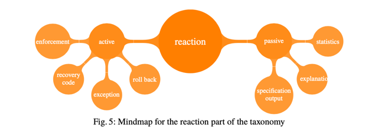

# Tools

## Taxonomy of static code analysis tools

静态代码分析工具分类

Table 1:  Analysis of selected static code analysis tools

| Tool       | Rules                                                                       | Configurability     | Extensibility | Technology       | Supported languages | Availability | User experience                                                | Releases                               | Input       | Output          |
|------------|-----------------------------------------------------------------------------|---------------------|---------------|------------------|---------------------|--------------|----------------------------------------------------------------|----------------------------------------|-------------|-----------------|
| CheckStyle | general, style, naming, performance, maintainability                        | XML file, rulesets  | Possible      | Syntax, dataflow | Java                | Open source  | Environment integration, CL                                    | Frequently >= 3 times a year           | Source code | List, XML, HTML |
| FindBugs   | general, style                                                              | Rulesets            | Possible      | Syntax, dataflow | Java                | Open source  | All options in category included                               | Frequently Byte >= 3 times code a year | Bytecode    | List, XML       |
| Gendarme   | General, style, concurrency, exceptions, interoperability, security, naming | Rulesets, GUI       | Possible      | Syntax, dataflow | All .NET            | Open source  | Automatic locating errors in code                              | Frequently >= 3 times a year           | Byte code   | List            |
| StyleCop   | style, maintainability, naming, general                                     | Rulesets, Text file | Possible      | Syntax, dataflow | C#                  | Free         | CL, Environment integration, Automatic locating errors in code | Occasional ly < 3 times a year         | Source code | List            |

## A Taxonomy for Classifying Runtime Verification Tools⋆

Mindmap overviewing the taxonomy of Runtime Verification

Mindmap for the specification part of the taxonomy

Mindmap for the monitor part of the taxonomy

Fig. 4: Mindmap for the deployment part of the taxonomy

Fig. 5: Mindmap for the reaction part of the taxonomy

Fig. 6: Mindmap for the trace part of the taxonomy

