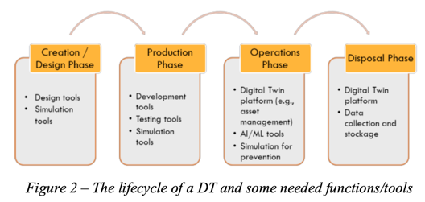
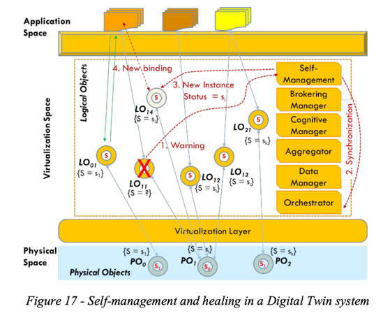
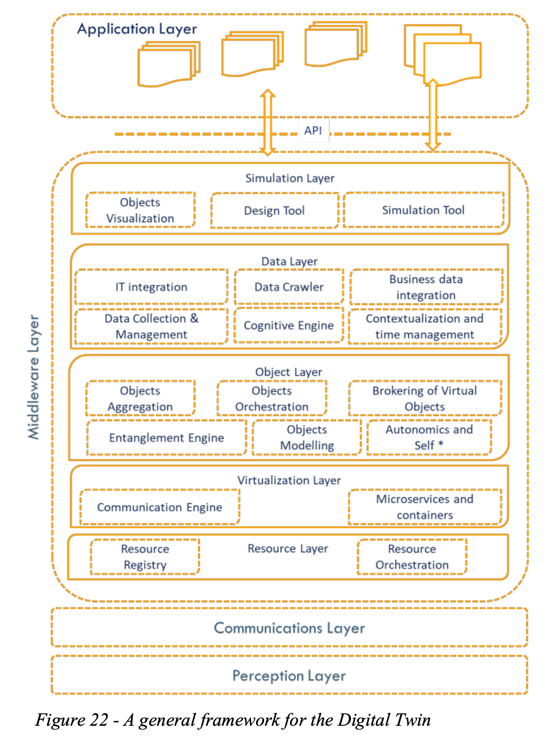

# Architecture Twin

## Digital Twin in the IoT context: a survey on technical features, scenarios and architectural models

Digital Twin

在每个阶段，都需要工具和功能才能正确执行流程。一些工具在不同的阶段列出。这是因为它们用于不同的目的。例如，
创建阶段的模拟可能用于选择一些产品选项
；在生产阶段，它可用于模拟产品的某些预期行为
，而在运营阶段，如果产品处于“压力”或在危急情况下使用，它可用于检查和预测某些故障。

在设计阶段，数字孪生将由一个逻辑对象表示，实际上是唯一存在的对象，它是所有未来物理对象的软件原型。一旦产品及其数字对应物离开设计阶段，
生产阶段就会将原型及其软件表示相关联，以便测试和试验未来的产品。在此阶段，DT 的软件方面有助于优化物理对象并进行测试，
否则将需要实施模型。在操作阶段，逻辑对象和产品（即物理对象）之间的关系可以用不同的方式实例化：1：1 定义意味着一个物理对象由一个逻辑对象表示，
而1： N指的是产品的n个物理实现指的是一个逻辑对象。换句话说，数字孪生将 n 个产品与单个软件表示相关联。在后一种情况下，
多个物理副本可以引用一个原型对象并进行协作以表示实例化对象类的实际功能。在某种意义上，数字孪生可以是一个元系统，代表产品的任何物理实例的典型行为。
物联网技术和功能的一个明显作用是在生产和运营阶段。在这些阶段，传感器和物联网平台可用于实际构建产品，然后用于感测和测量产品的行为和性能。

自我管理函数与 Orchestrator 同步，以确定需要哪些存储、计算和通信功能以及可以将其分配到何处。 然后创建一个新实例，
即 LO，根据 PO 和其他 LO 分配状态值，并将应用程序绑定到它。 应执行同步阶段以限制对应用程序的影响。 理想情况下，
应用程序不应该知道（并且在任何情况下都不会受到影响）正在使用的逻辑对象实例的更改。 在此特定情况下，
自我管理函数显示为功能块。 选择集中式或更分布式的解决方案取决于数字孪生平台的不同实现方式。

分层符合大型中间件开发的总体趋势，并且符合数字孪生平台范围的广泛性及其在关注点分离方面的需求。底层是与设备、边缘和云资源交互的层，
并考虑如何使用它们、如何虚拟化以及如何利用它们的特性。需要一些功能来分配正确的资源并虚拟化基础设施中的功能/对象。
此外，由于一些 LO 的严格需求，必须优化通信，特别是为了有效地支持纠缠。分层本质上源自网络资源虚拟化的当前发展，例如 ETSI [295] 所定义的。
上层处理数字孪生的主要属性，对象层致力于逻辑对象的生命周期及其存在。这包括对象建模、实例化、自我管理、编排、纠缠等功能。
数据层处理数据的收集和上下文化，以及执行数据分析和信息推断。此外，还有爬取功能，以收集非由实物直接提供的外部信息。
可以在此处为特定问题域添加语义和本体论。仿真层支持 DT 的可视化、它们的仿真以及用于设计和定义它们的工具。