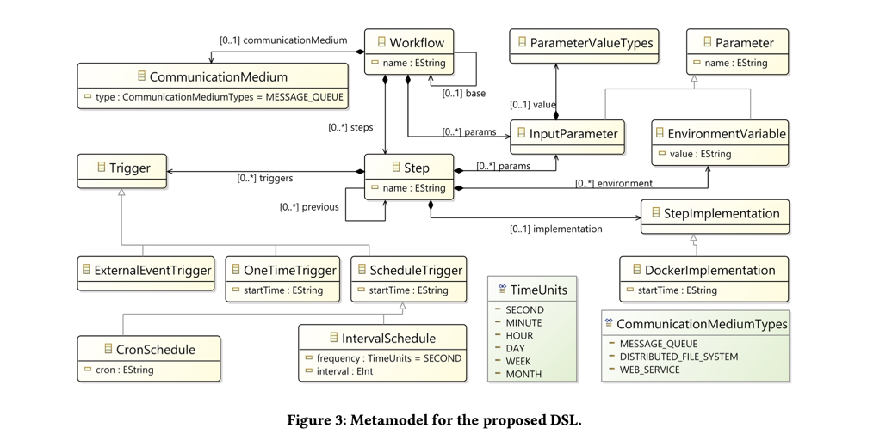

# Workflow

## Scalable Execution of Big Data Workflows using Software Containers

Samples: https://github.com/SINTEF-9012/ebw-prototype

工作流是需要按某种顺序执行以处理一组数据的一系列步骤。它表示执行不同数据摄取、转换和分析任务的一系列概念化步骤。
可以通过重用另一个工作流来定义给定的工作流。除了步骤之外，工作流还由通信媒介和一组参数组成。步骤是工作流的构建块。
一个步骤对应于工作流中的单个数据处理工作单元。工作流中的步骤是独立执行的，并且彼此隔离。此外，一个步骤可以有多种选择来实现它并触发执行机制。

参数是执行工作流所需的配置的常量值。参数用于运行具有不同配置的工作流。
除了工作流之外，参数还可以用于定义工作流步骤的配置。触发器表示步骤实例的执行是如何被实例化的。
步骤执行可以从以固定时间间隔运行的计划触发，也可以配置为仅运行一次（例如，在工作流初始化期间）。
执行也可以由外部事件触发（例如，从 REST API 调用或消息队列中输入数据的可用性）。
步骤实施是一个概念，表示如何执行工作流步骤的实际实施。基于容器的实现可以被视为步骤实现的示例。通信介质表示工作流步骤交换数据的机制。
工作流步骤可以使用消息队列将数据传递到另一个步骤。数据交换也可以使用分布式文件系统或网络服务来执行。

